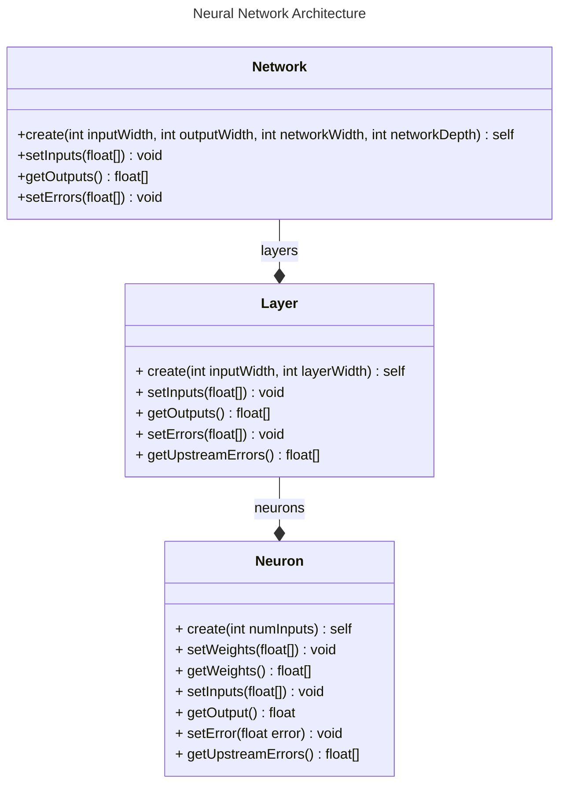

```mermaid
---
title: Neural Network Architecture
---
classDiagram

  class Network {
     +create(int inputWidth, int outputWidth, int networkWidth, int networkDepth) self

     +setInputs(float[]) void
     +getOutputs() float[]

     +setErrors(float[]) void
  }

  class Layer {
     + create(int inputWidth, int layerWidth) self

     + setInputs(float[]) void
     + getOutputs() float[]
     
     + setErrors(float[]) void
     + getUpstreamErrors() float[]
  }

  class Neuron {
     + create(int numInputs) self
     + setWeights(float[]) void
     + getWeights() float[]
     + setInputs(float[]) void
     + getOutput() float

     + setError(float error) void
     + getUpstreamErrors() float[]
  }

  Network --* Layer : layers
  Layer --* Neuron : neurons
```
