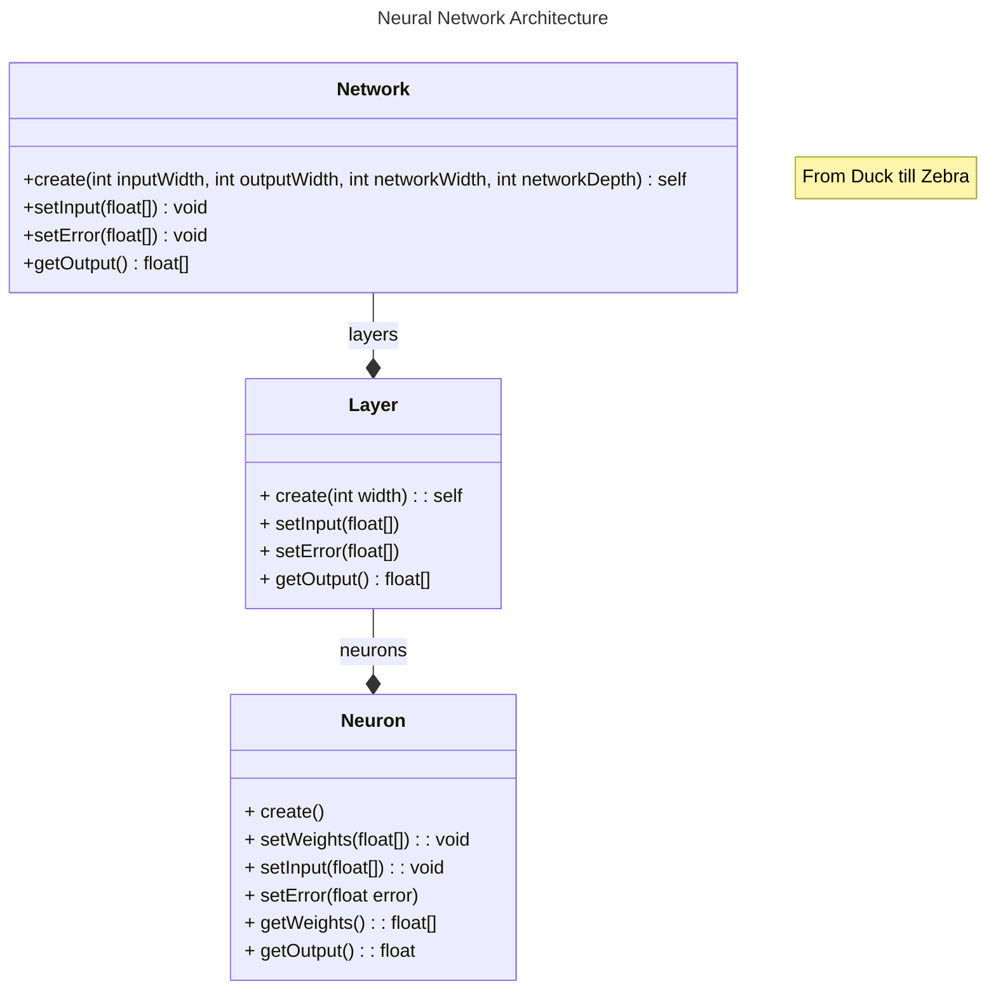

```mermaid
---
title: Neural Network Architecture
---
classDiagram
  note "From Duck till Zebra"

  class Network {
     +create(int inputWidth, int outputWidth, int networkWidth, int networkDepth) self
     +setInput(float[]) void
     +setError(float[]) void
     +getOutput() float[]
  }

  class Layer {
     + create(int width): self
     + setInput(float[])
     + setError(float[])
     + getOutput() float[]
  }

  class Neuron {
     + create()
     + setWeights(float[]): void
     + setInput(float[]): void
     + setError(float error)
     + getWeights(): float[]
     + getOutput(): float
  }

  Network --* Layer : layers
  Layer --* Neuron : neurons
```